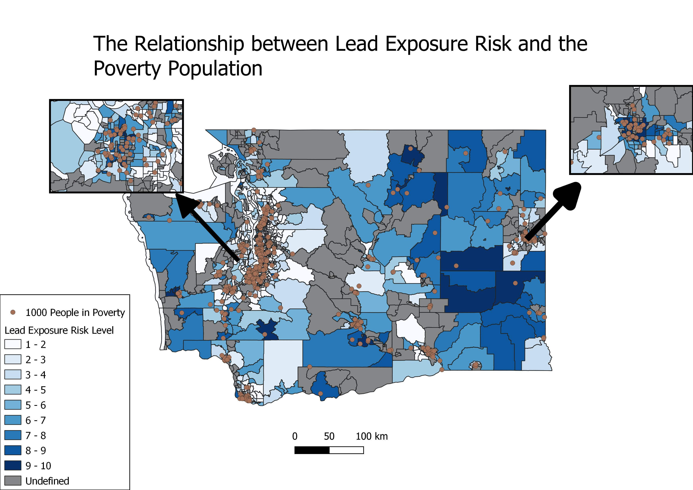

# Dustin Nguyen

nguyendustin76@gmail.com

https://www.linkedin.com/in/dustin-nguyen-583a8b224/

# Summary

A student attending the University of Washington majoring in Geography: Data Science. Looking for positions related to data science and GIS.

# Projects

## Crime and Greenspace Visualization in Seattle

 [Web Application]

- 	Developed an **interactive web application** to visualize the spatial relationship between crime incidents and greenspace in Seattle using Mapbox GL JS.
- 	Utilized a **heatmap** overlay to represent crime density, offering a different perspective on high-incident areas
- 	Integrated Seattle park boundaries as a geoJSON layer to display greenspace areas in Seattle

## Techn Company Layoffs Research and Analysis
[Shiny App]

- Created an interactive Shiny application using R that allows users to explore charts relating to the mass layoffs in tech companies 
- Designed an intuitive user interface that allowed users to filter data by various attributes, including company name, year, and whether companies were public or private

## Lead Exposure and Poverty 

- Utilized **QGIS** to answer a research question on the relationship between a county tract’s risk to lead exposure and its poverty population
- Used data from the Washington State Department of Health to create a **choropleth map** that visualized the level of risk to lead exposure in each county tract
- Conducted a **spatial analysis** that examined the relationship between the risk to lead exposure and poverty population in each county tract
  

[Web Application]: https://shankaraa2001.github.io/GEOG328_final_project/index.html
[Shiny App]: https://whtsky88.shinyapps.io/final-project-whtsky88/
